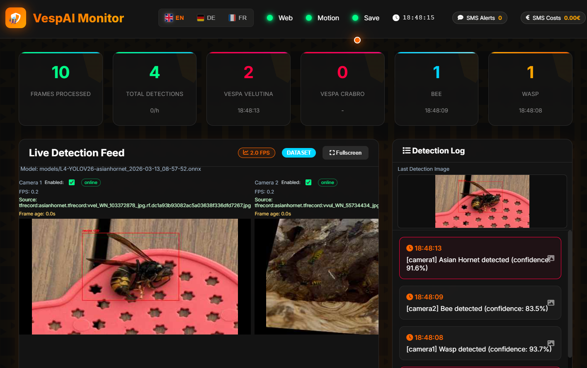
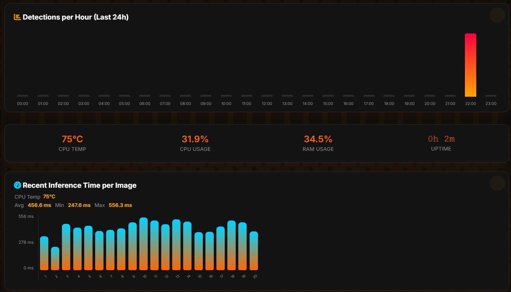

# RPi-vespai-C2 - Vesp Detection System

🐝 **Vesp detection system** with real-time computer vision, web dashboard, and SMS alerts and Push Notification (To be tested).

The system is designed to run on a Raspberry Pi 5 with either a USB camera or a Raspberry Pi Camera Module. The difference between this and RPi-VespAI is that this project is experimenting using two cameras. RPi-VespAI uses a YOLO26 deep learning trained model to identify and differentiate between Asian hornets (Vespa velutina) and European hornets (Vespa crabro) in real-time. 


## ✨ Features

- 🔍 **Real-time Detection**: YOLO26-based computer vision with custom hornet model
- 📊 **Web Dashboard**: Live video feed with statistics and detection analytics
- 🌍 **Multilingual Support**: Complete English/German/French interface with flag-based switching
- 📱 **SMS Alerts**: Automated notifications via Lox24 API with intelligent rate limiting - To be Tested
- 🎯 **Motion Detection**: CPU-efficient motion-based optimization
- 📈 **Data Analytics**: Comprehensive logging, hourly statistics, and detection history
- 📱 **Mobile Responsive**: Optimized web interface with adaptive charts (24h/4h views)
- ⚡ **Performance Optimized**: Non-blocking operations, data caching, reduced API calls
- 🏗️ **Modular Architecture**: Clean, maintainable codebase with separation of concerns

---
# Screenshots





---

## 🚀 Quick Overview

### 1. Hardware and Software
This will probably work on a normal PC with Linux. 
However its been designed and tested for Raspberry Pi 5 with the goal to make it self contained running on a battery and solar charger.
For the camera: A normal USB WebCam e.g Logitech can work.
The Raspberry Pi Camera Module 3 is supported through Picamera2 while preserving the USB camera option.

- ✅ **Raspberry Pi 5** (full support)
- **Memory**: 2GB RAM minimum, 4GB recommended
- **Storage**: 1GB free space for models and dependencies
- **Camera**: USB camera or CSI camera (Raspberry Pi)

The installation is based on PyTorch and the installation process will install all the required dependencies
- **Python**: 3.7+ (3.9+ recommended for Raspberry Pi)  
- The system was developed on Python 3.13 as the default with the Debian distro.


### 2. Installation
Refer to the Install.md doc under the docs folder


### 3. Access Dashboard
Once Installed and running, open your browser to: `http://localhost:8081`
or replace localhost with the IP address if the RPi.

PS: To get a **demo**: Click on the Red Live button in the Live Feed. This will change the feed from Camera to the Dataset, streaming images from the dataset into the detector with results then logged as if running live.

- **Live Video Feed**: Real-time camera stream with detection overlays
- **Statistics Cards**: Frame count, detection counts, system stats
- **Detection Log**: Chronological list of all detections with timestamps
- **Hourly Chart**: 24-hour detection history visualization
- **System Monitor**: CPU, RAM, temperature monitoring
- **Inference Time**: Time taken by model to classify image

---

# Security Considerations
- Never commit `.env` files to git
- Use strong SMS API credentials
- Consider VPN access for remote monitoring
- Regular security updates on Pi OS

# Performance Optimization
- Use motion detection (`--motion`) to reduce CPU usage
- Adjust confidence threshold based on your environment
- Consider GPU acceleration for better performance (if on a PC)
- Monitor system resources via dashboard
- Moving from a YOLOv8 Model to YOLO26 reduced the inference time taken from 2700ms down to around 1700ms using a USB Webcam and down to <500ms using the Pi Camera Module 3


## Testing
- Test with various lighting conditions
- Verify SMS delivery and costs
- Check web interface on mobile devices
- Validate motion detection accuracy

---

## Troubleshooting
See the TROUBLESHOOTING doc in the docs folder


## Citation
**Based on the research:** *VespAI: a deep learning-based system for the detection of invasive hornets* published in Communications Biology (2024). DOI: [10.1038/s42003-024-05979-z](https://doi.org/10.1038/s42003-024-05979-z)

If you use this project in your research or work, please cite the original research:

```bibtex
@article{vespai2024,
  title={VespAI: a deep learning-based system for the detection of invasive hornets},
  journal={Communications Biology},
  year={2024},
  volume={7},
  pages={318},
  doi={10.1038/s42003-024-05979-z},
  url={https://doi.org/10.1038/s42003-024-05979-z}
}
```
**Credits** This project is based on the work done by Jakob Zeise (https://github.com/jakobzeise/vespai/)


## License

This project is licensed under the MIT License - see the LICENSE file for details.

**Important:** This implementation is based on research published in Communications Biology. The original research methodology and concepts are attributed to the authors of the cited paper.

---
# Special Thanks
**Prof. Dr. Guido Salvanesch and the Swiss Cyber Institute**
Thanks for all the courses, classes, workshops and inspiration!


